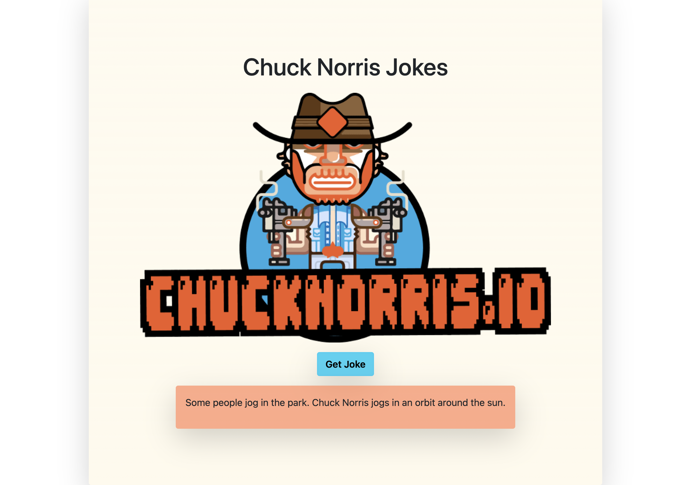

# Chuck Norris Jokes 

## Description

Chuck Norris Jokes is a fun web application that displays random Chuck Norris jokes fetched from the Chuck Norris API. The app allows users to click a button to generate a new joke and provides an interactive feature where the image of Chuck Norris disappears on hover.

### Features

- Random Chuck Norris joke generation
- Interactive image hover effect
- Responsive design using Bootstrap framework

### Technologies Used

- HTML
- CSS (including Bootstrap)
- JavaScript (using the MVC pattern)

### Deployment

The Chuck Norris Jokes Web App is deployed and can be accessed [here](https://tijanamilenkovic-chuck-norris-jokes.netlify.app).
 

